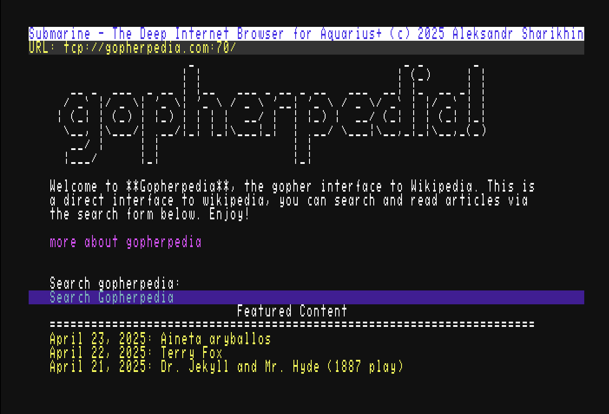

# Submarine

A Gopher browser designed for your Aquarius+ computer.



## Getting Started

1. **Configure WiFi** on your Aquarius+ computer. *([The emulator](https://github.com/fvdhoef/aquarius-plus/releases/tag/V1.3) comes with network support enabled by default.)*

2. **Download** the `submarine.aqx` file from the [releases page](https://github.com/nihirash/aqp-submarine/releases) and **copy** it to your SD card. You can place it in any directory, including the root of the file system.

3. **Launch** the application from BASIC using the following command:

   ```
   run "submarine.aqx"
   ```

4. **Enjoy** exploring the Gopher network!

## Features

With Submarine, you can:

- **Browse Gopher Sites:** Navigate through various Gopher servers seamlessly.
- **Search Functionality:** Perform search queries with user input.
- **Download Binaries:** Retrieve binary files from the network effortlessly.
- **Read Plain Text Files:** Access and read text-based content from Gopher servers.
- **Listen to Music:** Enjoy PT3 and PT2 music formats directly within the browser.

## License

This project is licensed under [Nihirash's CoffeeWare License](License). 

Please respect the terms—it’s simple and straightforward.